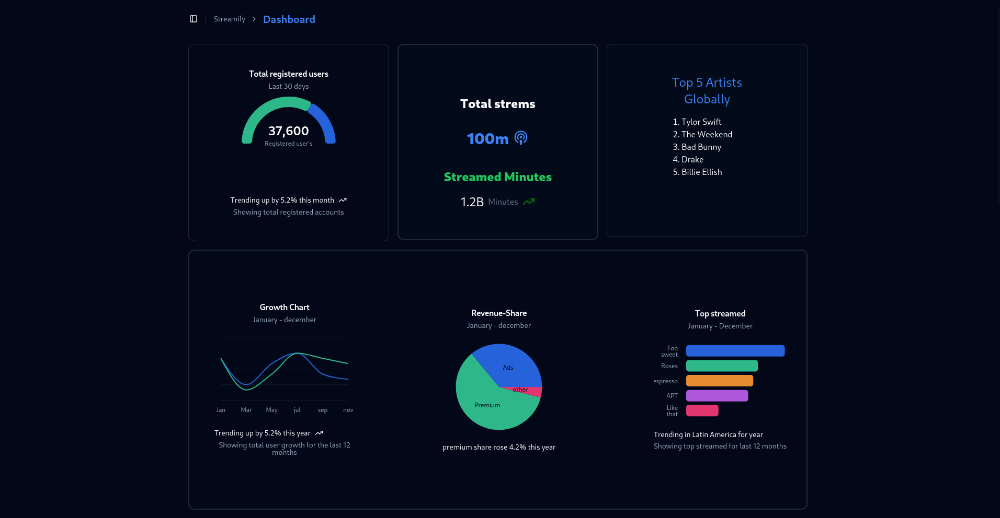

# React Project with ShadCN and Tailwind CSS

This project is a React application that utilizes **ShadCN UI** components and **Tailwind CSS** for styling. Follow the instructions below to set up the project locally.



## Features
- **ShadCN UI**: Pre-built UI components for a ui design.
- **Tailwind CSS**: Utility-first CSS framework for rapid styling.
- **Vite**: Fast development server for frontend projects.

## Prerequisites
Ensure you have the following installed:
- **Node.js** (>= 16.x)
- **npm** 

## Getting Started

### 1. Clone the Repository
```sh
git clone https://github.com/shambu2/dashboard.git
cd dashboard
```

### 2. Install Dependencies
Using npm:
```sh
npm install
npm run dev
```
The application should now be running at `http://localhost:5173/` 

## Project Structure
```
📦 dashboard
├── 📂 src
│   ├── 📂 components  # ShadCN components
│   |     
│   ├── 📜 App.jsx     # Main app file
│   ├── 📜 index.js
├── 📜 tailwind.config.js
├── 📜 package.json
├── 📜 README.md
```

## Deployment
To build the project for production:
```sh
npm run build
```

